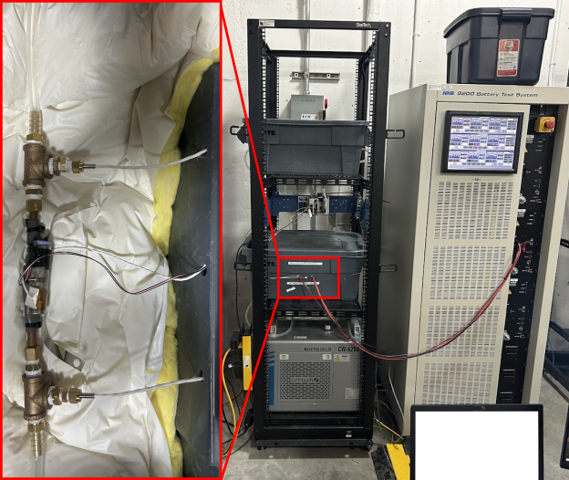

# HPPC Tests
- All single cycle tests data will be in this folder.
- LabView Code is included.

## Datasets
- All datasets have HPPC data at different C-Rates
- Data was collected on LCIC test-setup:

    <p align="center">
    
    </p>


## File Structure
```file
📁 dataset-1
├── 📁 Cycle0_.5CDischarge
    ├── 📄 40T_DischargeCycle0.lvm
    ├── 📄 40T_HPPCTest0.5C.lvm
    ├── 📄 40T_HPPCTest1C.lvm
```